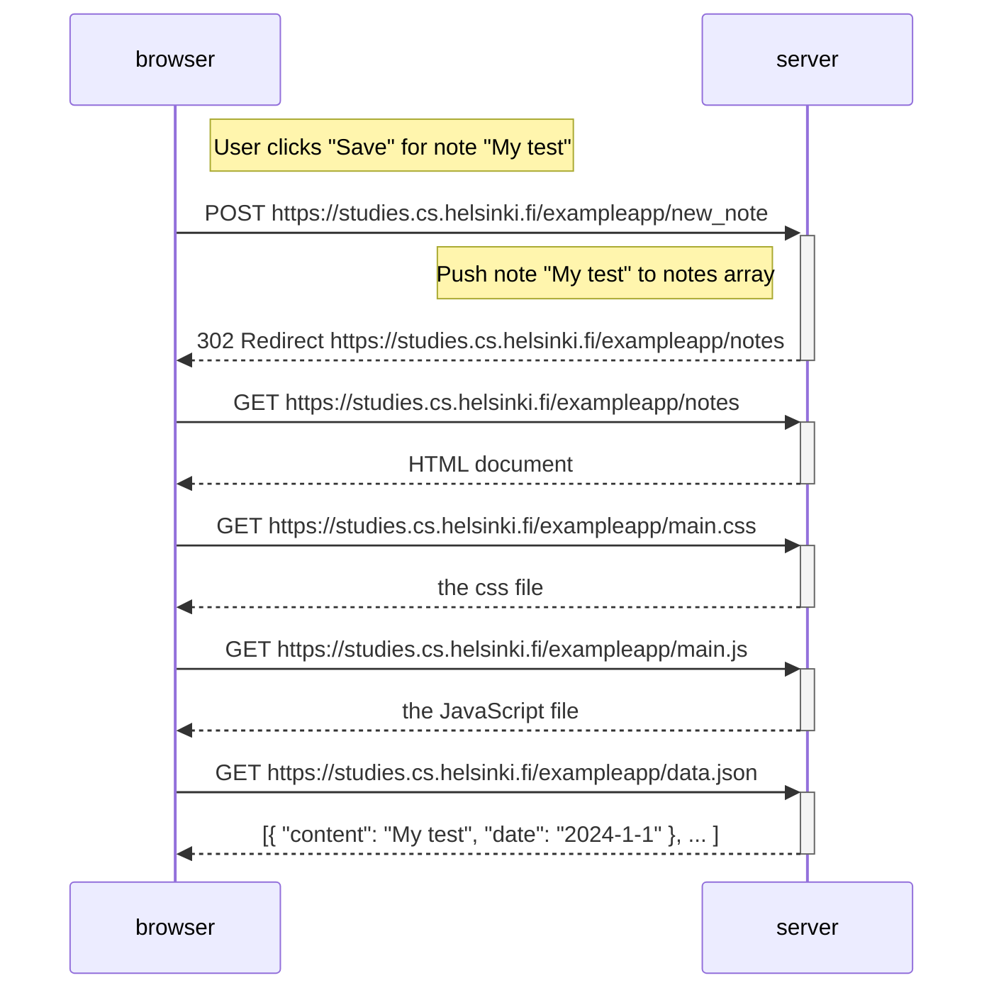

# Exercise 0.4

```mermaid
sequenceDiagram
    participant B as browser
    participant S as server

    Note right of B: User clicks "Save" for note "My test"
    B->>+S: POST https://studies.cs.helsinki.fi/exampleapp/new_note
    Note left of S: Push note "My test" to notes array
    S-->>-B: 302 Redirect https://studies.cs.helsinki.fi/exampleapp/notes

    B->>+S: GET https://studies.cs.helsinki.fi/exampleapp/notes
    S-->>-B: HTML document

    B->>+S: GET https://studies.cs.helsinki.fi/exampleapp/main.css
    S-->>-B: the css file

    B->>+S: GET https://studies.cs.helsinki.fi/exampleapp/main.js
    S-->>-B: the JavaScript file

    B->>+S: GET https://studies.cs.helsinki.fi/exampleapp/data.json
    S-->>-B: [{ "content": "My test", "date": "2024-1-1" }, ... ]
```