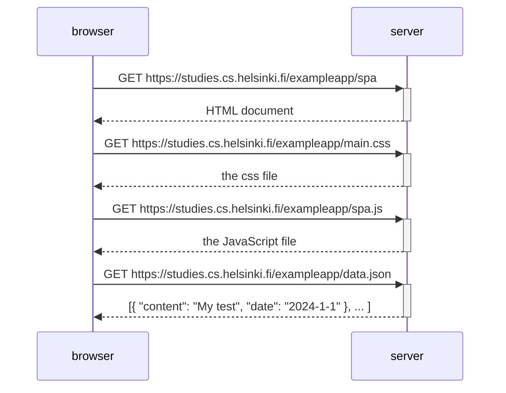

# Exercise 0.5

```mermaid
sequenceDiagram
    participant B as browser
    participant S as server

    B->>+S: GET https://studies.cs.helsinki.fi/exampleapp/spa
    S-->>-B: HTML document

    B->>+S: GET https://studies.cs.helsinki.fi/exampleapp/main.css
    S-->>-B: the css file

    B->>+S: GET https://studies.cs.helsinki.fi/exampleapp/spa.js
    S-->>-B: the JavaScript file

    B->>+S: GET https://studies.cs.helsinki.fi/exampleapp/data.json
    S-->>-B: [{ "content": "My test", "date": "2024-1-1" }, ... ]
```