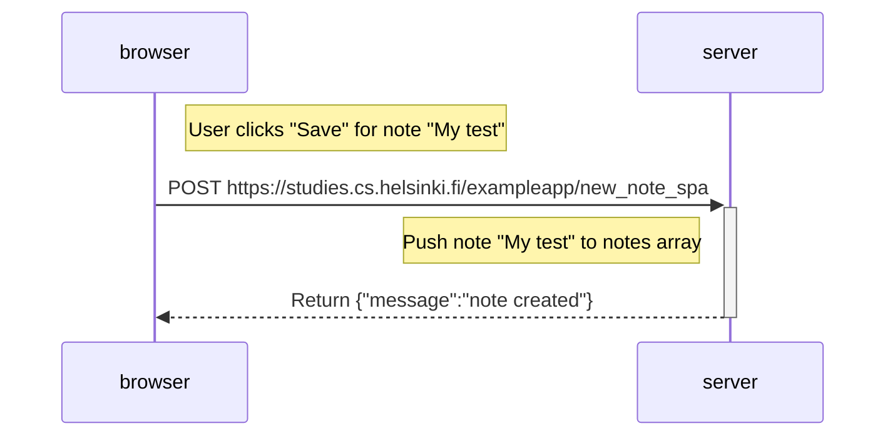

# Exercise 0.6

```mermaid
sequenceDiagram
    participant B as browser
    participant S as server

    Note right of B: User clicks "Save" for note "My test"
    B->>+S: POST https://studies.cs.helsinki.fi/exampleapp/new_note_spa
    Note left of S: Push note "My test" to notes array
    S-->>-B: Return {"message":"note created"}
```